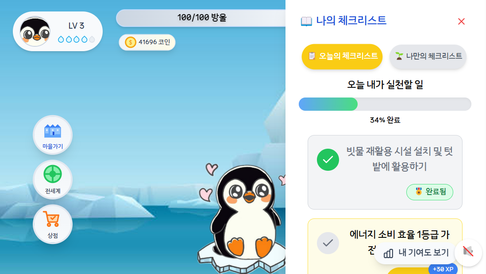
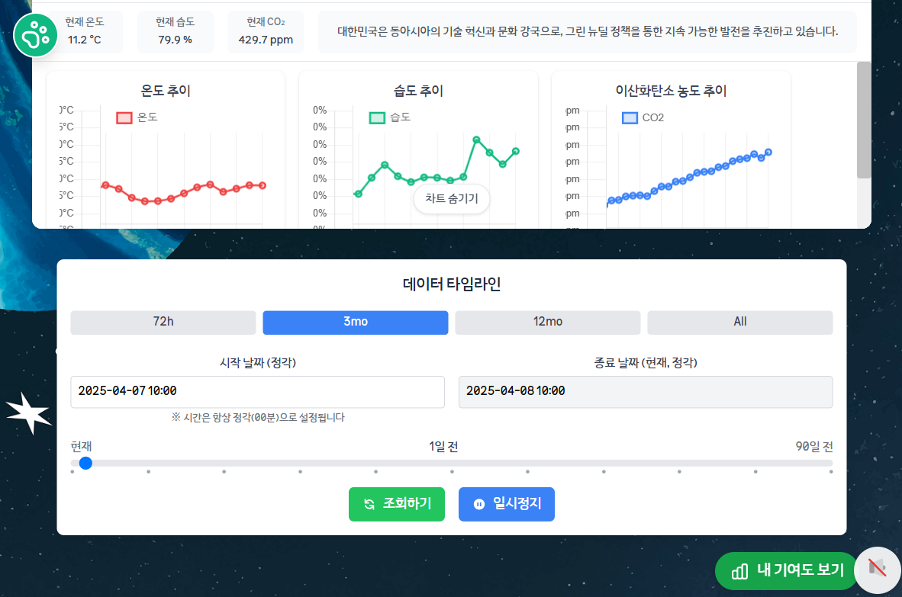
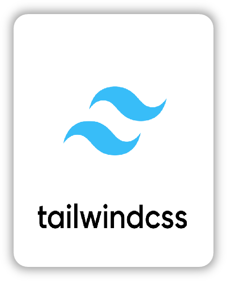

 

# 에코니멀 (Econimal)
> 빅데이터 분산 처리 기술과 게이미피케이션을 활용한 참여형 환경 에듀테크 서비스

## 💡 기획 의도
`[국제사회가 합의한 ‘기후변화 마지노선’ 1.5도 돌파]`
> 
에코니멀은 심각해지는 기후 변화 문제에 대응하여, 기존의 수동적이고 이론 중심적인 환경 교육에서 벗어나고자 기획했습니다.

> 
아이들이 게이미피케이션 방식을 통해 환경 보호 활동에 능동적으로 참여하고, 환경 문제에 대한 경각심을 자연스럽게 재미있게 학습할 수 있는 환경 에듀테크 서비스입니다.

## ✨ 주요 기능

- **데일리 환경 챌린지**: 매일 제공되는 환경 보호 관련 활동 체크리스트 실천

- **나만의 환경 미션 만들기**: 직접 환경 보호 목표를 설정 & 실천하는 나만의 체크리스트

- **환경 퀴즈**: 환경 정책, 물/에너지 절약, 오염 등 다양한 주제의 퀴즈 풀이 및 학습

- **나의 환경 기여도**: 퀴즈 기록 및 활동 내역기반 사용자 환경보호 기여도 시각화

- **캐릭터 커스터마이징**: 활동 보상으로 얻은 코인으로 나만의 캐릭터와 배경 아이템 구매 및 적용

- **글로벌 환경 데이터**: 전 세계 국가(27개국) 실시간 온도 · 습도와 이산화탄소 정보 시각화

## 🖼️ 실제 서비스 화면

  
&nbsp;&nbsp;에코니멀 주요 화면

|               **로그인**                |           **회원 가입 (이메일 인증)**           |
|:------------------------------------:|:--------------------------------------:|
|        |        |
|               **프롤로그**               |               **캐릭터 선택**               |
|          |          |
|              **메인 화면**               |               **마을 화면**                |
|        |           |
|             **탄소 배출 퀴즈**             |               **퀴즈 결과**                |
|      |  |
|             **일일 체크리스트**             |          **커스텀 체크리스트 AI 검증**           |
|    |     |
|             **체크리스트 완료**             |               **배경 상점**                |
|       |       |
|          **전세계 환경 데이터 보기**           |         **데이터 타임라인 (시간별 변화)**          |
|   |       |
|           **AI 나의 환경 기여도**           |             **최종 AI 피드백**              |
|   |        |
|          **마이페이지 & 알림 모달**           |                                        |
|  |                                        |

## 주요 기술 및 구현 사항

- **대규모 환경 데이터 처리**: Hadoop & Spark 이용해 **약 812만 개** 데이터 분산저장 및 병렬처리

- **매 시간 기후데이터 캐싱 처리**: Redis 활용해 데이터 조회 쿼리 캐싱, **700ms -> 10ms 개선**

- **데이터 파이프라인 자동화**: Airflow 활용하여 주기적인 외부 데이터 수집, 저장, 가공 과정 자동화

- **AI 기반 기여도 분석**: ChatGPT API 연동하여 사용자의 활동 데이터 기반 환경 기여도 분석 및 피드백 생성

- **웹 성능 최적화**: HTTP/2 프로토콜 도입을 통한 통신 효율성 증가 및 응답 속도 **약 20% 향상**

- **데이터 시각화**: Chart.js, D3.js 활용하여 복잡한 환경 데이터를 사용자가 이해하기 쉬운 차트로 시각화

## 기대 효과

- 타겟: 유치원생 ~ 초등학생
- 교육 효과: 전 세계 환경데이터 시각화 통한 **환경 문제 인식 증대**
- 동기 부여: 자신의 작은 행동이 환경에 긍정적인 영향을 미치는 **'나비 효과'** 체감
- 학습 재미: 캐릭터 육성 및 꾸미기를 통해 환경지식 습득 및 활동참여 **동기 강화**

## 🔗[API 설계](https://www.notion.so/BE-API-1a1af82ee657818d8f0ede60c87266ac?pvs=4)

## 🛠️ 프로젝트 아키텍쳐

 

# 🤔 트러블 슈팅 및 문제 해결 경험

프로젝트 진행 중 발생했던 주요 기술적 문제들과 해결 과정입니다.

- **백엔드 테스트 효율화**: @Sql 어노테이션 활용 시 반복적인 테스트 데이터 설정 문제 해결
  - [@Sql 반복줄이기](https://www.notion.so/Sql-1c0af82ee65780d2a3b6d9c2f6ae4a6e?pvs=4)

- **JPA 영속성 컨텍스트 이해**: 영속성 컨텍스트의 동작 방식 차이로 인한 데이터 불일치 문제 해결
  - [JPA 영속성 컨텍스트 문제](https://www.notion.so/JPA-1-1c7af82ee6578018a4a9dcbd81233b2d?pvs=4)

- **사용자 인증**: 이메일 인증 방법
  - [이메일 인증](https://www.notion.so/1bbaf82ee657809f99dfc2492a7040bc?pvs=4)

- **프론트엔드 상태 관리**: Props Drilling 문제 해결
  - [Props Drilling](https://www.notion.so/FE-UI-Props-Drilling-1ceaf82ee6578021b26dfdee56ee8c4b?pvs=4)

- **프론트엔드 라우팅 이슈**: 조건에 따른 동적 라우팅 처리 이슈 해결
  - [캐릭터 라우팅 이슈](https://www.notion.so/FE-1ceaf82ee657803f93c4fb038330840b?pvs=4)

- **Spark 쿼리 최적화 시도 과정**
  - [데이터 쿼리 최적화 시도](https://www.notion.so/Spark-1ceaf82ee6578008aff3fbd2d8ed148a?pvs=4)

<h1>📚 기술 스택</h1>
  

    <h3>Frontend</h3>
    
    
     
    
    
     
    
    
    

  

  

    <h3>Backend</h3>
    
    
     
    
    
     
    
    
  

  

    <h3>Infra</h3>
    
    
     
    

  

 

  

    <h3>외부 서비스</h3>
    

  

# 프로젝트 일정

### 아이디어 선정: 2025.02.24 ~ 02.28 (5일)

### 기획: 03.03 ~ 03.07 (5일)

### 개발: 03.10 ~ 04.04 (4주)

### 테스트 : 04.01 ~ 04.10 (10일)

### 프로젝트 종료: 2025.04.11

# 💕‍ 프로젝트 팀원
이름을 누르면 GitHub 이동합니다

|             Backend              |               Backend               |       Backend                        |
|:--------------------------------:|:-----------------------------------:|:------------------------------------:|
|    |       |        |
| [김현우](https://github.com/8resd8) | [윤윤호](https://github.com/yun-yunho) | [주재완](https://github.com/red-sprout) |

|                 Frontend                 |              Frontend              |               Frontend               |
|:----------------------------------------:|:----------------------------------:|:------------------------------------:|
|            |    |        |
| [박희원](https://github.com/heeeeeeeeeee1)  | [안주민](https://github.com/JUMINAHN) | [황다빈](https://github.com/Daba-byte)  |

# 프로젝트 팀원 역할

## Backend

### 김현우

- 백엔드 초기 환경설정 및 패키지 구조 설계
- JWT 기반 인증/인가 시스템 구축
- 상점 시스템 로직 개발
- 전역 예외처리 설계
- Spring AOP 활용한 로그, 에러 출력
- 기후 데이터 812만 개 인덱스 최적화 성능 개선
- 기후 데이터 조회 API 응답속도 개선을 위한 Redis 캐싱 및 스케줄링 적용
- HTTP/2 프로토콜 도입 및 적용

### 주재완

- 프로젝트 팀장
- 프로젝트 매니저
- 환경 데이터 회귀 분석 담당
- 사용자 마을 이벤트 퀴즈 처리

### 윤윤호

- 인프라 전체 총괄
- blue-green 무중단 배포
- Spring Actuator 활용한 Prometheus - Grafana 모니터링
- 가상 컨테이너 환경의 Hadoop-Spark 클러스터링 구축
- Airflow 기반 데이터 수집-가공 자동화 파이프라인 구축
- 커스텀 체크리스트 로직 구현

## Frontend

### 박희원

- 화면 렌더링 최적화
- 이벤트 전역 알림

### 안주민

- 프론트 프로젝트 초기 개발환경 세팅
- PWA 환경 세팅
- 웹 - 앱 동기화
- 캐릭터 / 체크리스트 / 상점 로직개발

### 황다빈

- 유저 관련 페이지(UI/UX 포함) 전반 개발 및 상태관리 구조 설계
- ‘나의 기여도’ 페이지의 시각화 로직, AI 피드백 연동 결과 표시 기능 개발
- 세계 환경 데이터 기반의 인터랙티브 세계지도 구현:
- D3.js + GeoJSON 기반 국가별 색상 시각화 및 줌(확대/축소) 기능 구현
- React-D3 연동을 통한 마우스오버/클릭 이벤트 적용
- 성능 최적화: GeoJSON 경량화 및 D3 계산 최소화
- 타임 슬라이더 기반 시각화:
- 연도/월/일/시간 별 환경 지표 변화 시각화 구현
- React + Zustand 기반으로 슬라이더와 시각화 동기화
- 슬라이더 값 변경 시 세계지도, 차트, 텍스트 데이터가 동시에 업데이트 되도록 설계
- 글로벌 환경 데이터(27개국 기후 정보) 시각화 UI 구성:
- Chart.js를 활용한 국가별 환경 지표 시계열 차트 구성
- 지도 선택과 슬라이더 이동에 따른 차트 데이터 변경 로직 구현
- 메인 캐릭터 커스터마이징 인터페이스 기획 및 프론트 구현
- Axios 기반 API 요청 구조 설계 및 다양한 백엔드 API와 연동
- Zustand를 활용한 전역 상태 관리 구조 설계 및 모듈화
- 사용자 경험 중심 UI디자인 직접 설계 및 적용 (Figma 활용)
- 직접 제작한 캐릭터 일러스트 및 아이템 그래픽 다수 적용 (SVG/PNG 사용)
- 사용자 인터랙션 중심의 UX 효과 (애니메이션) 설계 및 구현
- 팀 내 디자이너 부재 상황에서 UI 설계와 프론트 구현을 병행하며 전반적인 디자인 리드