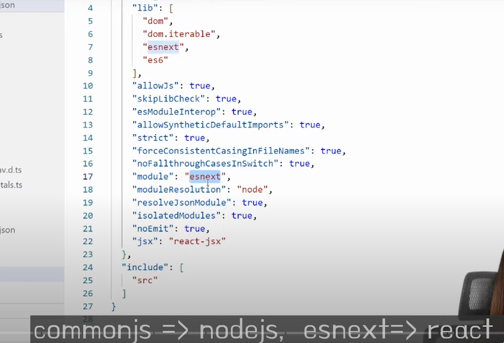

## 1. 📘 리액트 타입스크립트 프로젝트의 초기 설정

### 1.1 타입스크립트 프로젝트 생성 및 기본 설정

- 리액트프로젝트를 타입스크립트로 생성하려면 'npx create-react-app' 뒤에 '**템플릿 타입스크립트**'를 추가해야 한다.
  ```
  npx create-react-app my-app --template typescript
  ```
- 'tsconfig'가 기본 세팅에 포함되어 있으며, 소스 파일은 'tsx' 확장자를 가진다.
- 'tsconfig'에서 기본 ES 버전이 5로 설정되어 있으며, ES6로 변경 가능하다.
- 모듈은 Commonjs 대신 esnext로 설정하여 리액트에서 사용한다.

### 1.2 함수 컴포넌트 타입 정의

- 리액트함수 컴포넌트는 리액트에서 제공하는 타입을 사용하여 쉽게 **타입 정의**를 할 수 있다.
- `React.FC`를 사용하여 함수 컴포넌트의 타입을 지정할 수 있다.
- 예시로 레스토랑 정보를 보여주는 웹사이트를 만들고, 컴포넌트에 데이터를 전달하여 보여주는 것을 목표로 한다.



- 컴포넌트 타입 지정
    - React.FC
    - 이거 옛날거 아니야? CRA 쓸 때 쓰던건가… 몇 버전 부터인가…
    - https://young-taek.tistory.com/278
        
        
        
        
        

## 2. 🛠️ 타입스크립트에서 타입 정의하기

- 타입스크립트는 데이터의 타입을 명확히 정의하는데 강력한 기능을 제공하며, 이러한 타입이 무엇인지 알지 못할 경우 문제가 발생할 수 있다.
- 데이터의 타입을 사용자에 맞게 직접 정의할 수 있으며, 이는 객체나 배열 등 다양한 형태로 이루어질 수 있다.
- 타입을 정의하는 방법으로는 **인터페이스**와 **타입 정의**가 있으며, 두 방식에는 약간의 차이가 있지만 기본적으로는 유사하다.
    - +) interface와 type의 차이 ?
    - 
- 객체의 다양한 속성을 정의하기 위해 타입의 **세분화**가 유용하며, 이를 통해 나중에 필요한 데이터 타입을 효율적으로 재사용 할 수 있다.
- 예를 들어, 레스토랑의 메뉴 정보를 담기 위해 **레스토랑** 타입과 **주소** 타입 등을 정의할 수 있으며, 이를 통해 더 깔끔하고 간결한 코드 작성이 가능하다.

## 3. 🚀 리액트에서 useState와 제네릭 사용하기

- 리액트의 **유즈 스테이트**를 사용하여 성격이 주어진 데이터로 상태를 설정할 수 있다.
    
    ```tsx
    import {useState} from 'react'
    import "./App.css";
    import Store from "./Store";
    import { Restaurant } from "./restaurant";
    
    const data:Restaurant = {
      name: "밥먹자 식당",
      category: "korean",
      address: {
        city: "Ulsan",
        detail: "somewhere",
        zipCode: 2345678,
      },
      menu: [
        { name: "rice", price: 1000, category: "ect" },
        { name: "kimbab", price: 4000, category: "meals" },
      ],
    };
    
    // React.FC 사용 지양되고 있는 것이 아닌지?
    // React.FC : 컴포넌트 타입 지정
    const App: React.FC = () => {
      const [myRestaurant, setMyRestaurant] = useState<Restaurant>(data)  // <> : 제네릭. useState를 부르는 순간 타입을 정의하고 싶을 때.
    
      // setMyRestaurant(4) // 이렇게 사용하면 타입에러 발생(Argument of type 'number' is not assignable to parameter of type 'SetStateAction<Restaurant>')
      
      return (
        <div className="App">
          <Store info={myRestaurant} />
        </div>
      );
    };
    
    export default App;
    
    ```
    
- **제네릭** 문법을 통해 유즈 스테이트의 타입을 지정함으로써 함수에 들어가는 타입을 명확히 할 수 있다.
- 예를 들어, 넘버 타입으로 설정할 경우 타입 불일치로 에러가 발생할 수 있으며, 이를 통해 상태가 올바르게 선언되었음을 알 수 있다.
- 컴포넌트의 프롭스타입을 지정해 주어야 하며, 이 프롭스또한 **인터페이스**를 사용하여 세부 타입을 정의할 수 있다.
    
    
    
    여전히 타입에러 발생
    
- props인 info를 Restaurant 타입으로 정의하면 되겠네
    
    ```tsx
    import { Restaurant } from "./restaurant"
    
    interface OwnProps {
      info: Restaurant
    }
    
    // React.FC에 들어오는 값이 제네릭이다!
    const Store:React.FC<OwnProps> = ({info}) => {
      return (
        <div>{info.name}</div>
      )
    }
    
    export default Store
    ```
    

- 함수 또한 프롭스로 전달할 수 있으며, 이를 통해 더 유연한 데이터 처리가 가능해진다.

## 4. 📜 타입스크립트의 **함수**와 **익스텐드** 개념

- changeAddress는 **함수**로, 입력 타입이 Address이고, 리턴 타입은 void로 설정할 수 있다.
    
    ```tsx
    import { Address, Restaurant } from "./restaurant"
    
    interface OwnProps {
      info: Restaurant,
      // 함수 타입
      changeAddress(address: Address):void // 리턴 값 없으면 void
    }
    
    // React.FC에 들어오는 값이 제네릭이다!
    const Store:React.FC<OwnProps> = ({info}) => {
      return (
        <div>{info.name}</div>
      )
    }
    
    export default Store
    ```
    
- 리턴 타입이 필요할 경우, 함수의 반환값에 따라 적절한 타입을 지정할 수 있으며, 예를 들어 리턴 타입이 void가 아닌 다른 타입인 경우도 있다.
- **extends**는 기존 타입에 새로운 요소를 추가하는 기능으로, 예를 들어 메뉴 타입에 추가 정보나 함수를 붙일 수 있으며, 이를 통해 코드 양이 줄어들고 실수 확률도 낮아진다.
- 타입스크립트에서 기존 타입을 상속받아 새로운 타입을 정의할 수 있으며, 예를 들어 매개변수나 속성이 겹치는 경우 이를 관리하는 기법이 필요하다.
- 특정 속성이 필요 없을 경우, 이를 제외하는 방식으로 새로운 타입을 설정할 수 있어 개발자의 편의성을 높인다.

## 5. 🔍 타입스크립트에서 타입 설정 및 활용

- 타입스크립트에서 특정 속성을 **빼주세요**라고 설정할 수 있으며, 이를 통해 불필요한 데이터를 **제외**할 수 있다.
    
    ```tsx
    // 일부를 뺴고 싶다면 Omit
    // Address에서 zipCode를 뺀 나머지 타입
    export type AddressWithoutZipCode = Omit<Address,'zipCode'>
    ```
    
    
    

- 예를 들어, 메뉴에서 **가격(price)** 속성을 빼버리면 에러가 발생하며, 이는 타입스크립트가 반드시 가격을 요구하기 때문이다.
    
    ```tsx
    import {Menu} from './restaurant'
    
    // Menu 타입에서 price 제외
    interface OwnProps extends Omit<Menu, 'price'> {
      showBestMenuName(name:string):string
    }
    
    const BestMenu:React.FC<OwnProps> = ({name, price, category, showBestMenuName}) => {
      return (
        <div>{name}</div>
      )
    }
    
    export default BestMenu
    ```
    
- 에러를 수정하기 위해 메뉴 타입에서 가격을 빼는 설정을 추가하면, **에러가 사라진다**.
- **픽(pick)** 방법을 사용하면 특정 속성만 선택적으로 가져올 수 있으며, 이를 통해 필요한 데이터만 요청하는 것이 가능하다.
    
    ```tsx
    // 일부만 가져오고 싶다면 Pick
    // Restaurant 타입에서 category 가져오기
    export type RestaurantOnlyCategory = Pick<Restaurant,'category'>
    ```
    
- Omit 사용 안하고 `?` 사용해도 된다.(~~ES6부터인가?~~)
    - 있을 수도 있고 없을 수 도 있고 ~
        
        
        
    - zipCode가 있어도 되는 상황에도 체크 안하고 넘어갈 수 도 있으므로 주의해서 사용하기

---

**[실전!]**

- API 응답에서 필요한 데이터를 처리할 때, **제네릭**을 활용하여 다양한 타입의 데이터를 효율적으로 다룰 수 있도록 타입을 설정할 수 있다.
    
    
    
    이걸 타입스크립트로 지정할 수 있다.
    
    - 제네릭은 어떤 타입의 데이터가 들어오는지 모를 때 사용하면 좋다.

---

+) Number 타입


zipCode에서는 "Number 타입", price는 "number 타입" 
Number type은  interface type이고 number는 원시 type이다. 두 개가 서로 다른 타입!

```tsx
const num: number = new Number(1) // Type "Number" is not assignable to type "number".
```

일반적으로 우리가 알고 있고 사용하는 숫자 타입의 개념은 아니기 때문에 "Number type"은 사용하지 않는 게 좋다고 공식 문서에서 권고